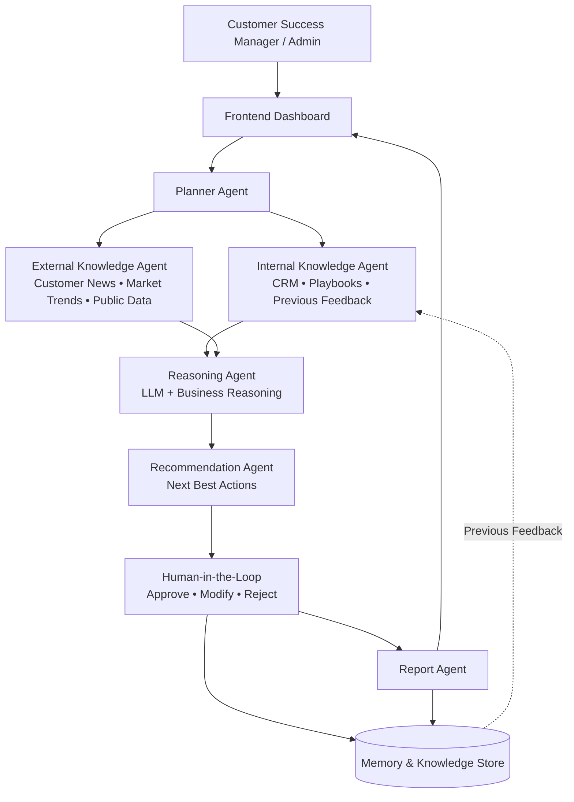
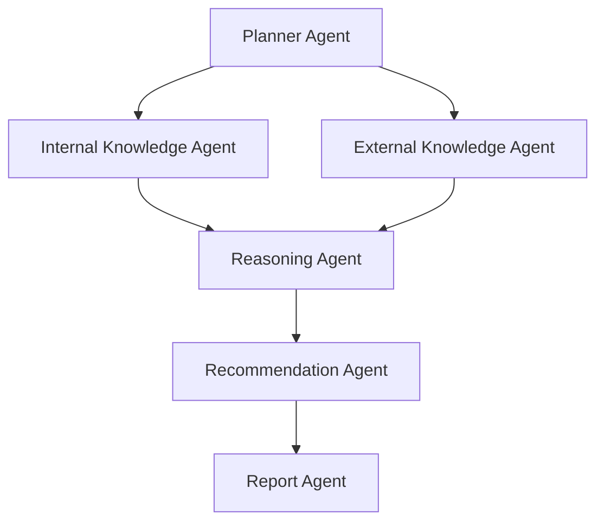
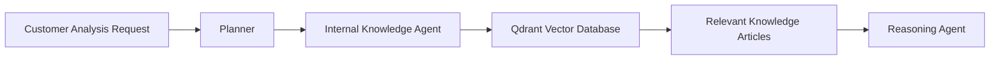
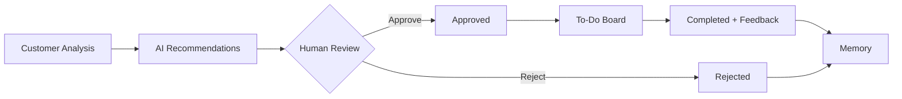

NAG—Next Action Generator—is an Agentic AI platform that transforms fragmented customer data into intelligent, explainable, and actionable business decisions, empowering Customer Success Managers to act faster and more effectively.
Our goal is : transform scattered customer data into clear, explainable, and prioritized business decisions
High-Level System Architecture

# Key Design Decisions

## Modular Multi-Agent Architecture

The platform follows a modular agent architecture where each agent is responsible for a single business capability. Agents communicate through a shared `AgentState`, enabling loose coupling, easier maintenance, and extensibility.

---

## Planner-Based Orchestration

The Planner Agent dynamically determines how the workflow should execute. It decides whether enterprise knowledge retrieval is required, assigns workflow priority, selects the analysis focus, and orchestrates the remaining agents.

* Dynamic workflow orchestration
* Knowledge retrieval planning
* Workflow prioritization
* Analysis focus selection

---

## Retrieval-Augmented Generation (RAG)

Enterprise knowledge is stored in Qdrant as vector embeddings. During analysis, the Internal Knowledge Agent retrieves relevant playbooks, troubleshooting guides, and best practices to ground recommendations with company knowledge.

---

## Memory-Driven Decision Intelligence

The platform stores previous recommendations, approval status, completion status, and feedback. Future analyses use this memory to avoid duplicate recommendations and determine the customer's next best action.

* Learns from completed recommendations
* Avoids recommending resolved actions
* Uses customer feedback for future reasoning
* Continuously improves recommendations

---

## Human-in-the-Loop Workflow

Recommendations are never executed automatically. Customer Success Managers review every recommendation before it becomes an actionable task.

---

## Evidence-Based Business Reasoning

Every recommendation is supported by customer interactions, CRM data, previous recommendations, and enterprise knowledge. This provides transparent and explainable AI-driven decision making.

* Customer interactions as evidence
* Enterprise knowledge grounding
* Memory-aware reasoning
* Explainable recommendations

---

## Dynamic Customer Health Assessment

Customer Health Score is calculated during analysis rather than relying on a stored value. It reflects the customer's current business situation using the latest interactions, historical context, and recommendation outcomes.

* Evidence-based health assessment
* Real-time business evaluation
* Context-aware scoring
* Historical trend consideration

---

## Shared Agent State

All agents exchange information through a shared `AgentState`, allowing seamless communication while keeping each agent independent.

* Centralized workflow state
* Loose coupling
* Simplified orchestration
* Easy extensibility

---

## Extensibility
New agents can be integrated into the workflow without modifying existing agents. The planner can orchestrate additional agents based on future business requirements.
Future extensions can include:
Calendar Connector (Google Calendar / Outlook Calendar)
Voice call transcript analysis
Recommendation effectiveness tracking
Email Drafting Agent
Role-based approval workflow

---

## Reusable Across Business Domains
The platform is designed to be domain-independent. By replacing the business rules, prompts, and enterprise knowledge, the same architecture can be applied across multiple B2B domains.
Examples:
* Customer Success
* SaaS Sales
* CRM Automation
* Healthcare
* Banking
* Enterprise Support
---
##Conclusion
## Summary

The platform combines modular AI agents, enterprise knowledge retrieval, memory, and human-in-the-loop validation to deliver explainable Next Best Actions. Its reusable and extensible architecture enables easy integration of new agents, enterprise systems, and business domains while maintaining scalability and maintainability.
